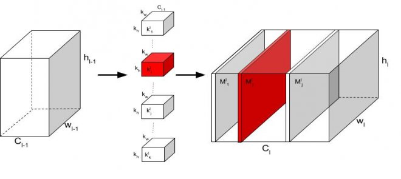
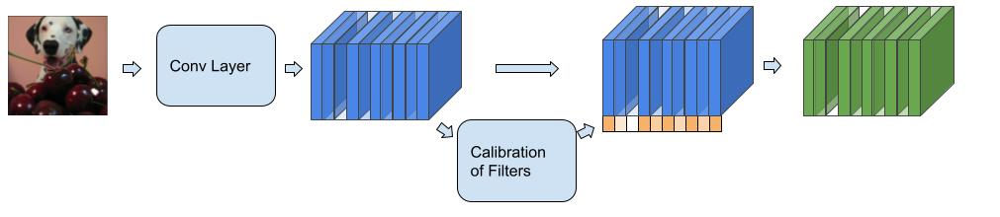
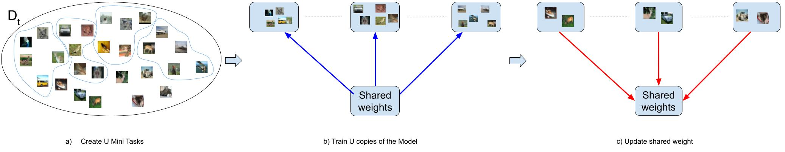

# Overcoming catastrophic forgetting using sparse coding and meta learning
## Abstract
Continuous Learning occurs naturally in human beings. However, Deep Learning methods suffer from a problem known as Catastrophic Forgetting (CF) that consists of a model drastically decreasing its performance on previously learned tasks when it is sequentially trained on new tasks. This situation, known as task interference, occurs when a network modifies relevant weight values as it learns a new task. In this work, we propose two main strategies to face the problem of task interference in convolutional neural networks. First, we use a sparse coding technique to adaptively allocate model capacity to different tasks avoiding interference between them. Specifically, we use a strategy based on group sparse regularization to specialize groups of parameters to learn each task. Afterward, by adding binary masks, we can freeze these groups of parameters, using the rest of the network to learn new tasks. Second, we use a meta learning technique to foster knowledge transfer among tasks, encouraging weight reusability instead of overwriting. Specifically, we use an optimization strategy based on episodic training to foster learning weights that are expected to be useful to solve future tasks. Together, these two strategies help us to avoid interference by preserving compatibility with previous and future weight values. Using this approach, we achieve state-of-the-art results on popular benchmarks used to test techniques to avoid CF. In particular, we conduct an ablation study to identify the contribution of each component of the proposed method, demonstrating its ability to avoid retroactive interference with previous tasks and to promote knowledge transfer to future tasks.

## Intuition
Continual Learning consists of being able to learn different tasks incrementally. Each task can modify all model weights in a method-free technique, causing each new task to modify what has been learned in the past. These modifications benefit the current task's training but cause interference with previous knowledge, losing earlier tasks' performance. This problem is known as catastrophic forgetting.
The practical causes of CF can be divided into two related problems:
1. The modification of previous weights
2. The low reuse of previously learned weight in new tasks
The first problem is the direct cause of the loss of performance in previous tasks. One way to eliminate interferences between tasks is to have their private network trained only with data from the current task. This idea eliminates the interference, but the positive transfer between tasks is lost, and the space required to save the models grows linearly with each new task.
An alternative is to use sparsity, which helps to select a percentage of model weights. This percentage of weights creates an internal path that resembles an internal sub-model that can solve a task. Thus, we can find multiple internal paths within the model, one for each task.
There is no reason to believe that these sub-models cannot share weights between them, which leads us to freeze previously trained weights to avoid interference. Ideally, we would like these frozen weights to be useful for tasks in the future.
This reusable idea leads us to the second problem: How to train reusable components? We add a new learning strategy based on meta-learning to foster those weights being useful to new tasks, using only the current task data.

## Method
To select each task's sub-models, we use group-sparsity, which identifies groups of weights instead of independent weights. Given that we are using convolutional layers, selected groups are convolutional filters since they detect the relevant patterns.
During the training process, we optimize the selected groups to solve the current task. Then, these groups are identified via binary masks and frozen not to be modified in future training sessions. Using binary masks to identify these weights helps avoid interference during training and keep performance during inference.
As seen in the following figure, each filter only affects its own activation map, which facilitates the use of masks to eliminate interference:

It should be noted that the new tasks can use the frozen weights, but they cannot modify them. Thus, by using it, we seek that there is a positive transfer between tasks.
To promote knowledge transfer, we add calibration functions per task that help normalize and calibrate the knowledge acquired in the past (frozen groups) with the knowledge learned in the unfrozen filters. In addition, these functions help to identify relevant filters (frozen or unfrozen) for the corresponding input. By multiplying each activation map by a value, we are specializing the solution to the input.

Trained groups are the foundation to start training a new task, and we want them to complement what the model learns in the new task. To encourage this transfer of knowledge, we must promote that the model learns patterns applicable across tasks. To encourage group sharing, we added a meta-learning process. 
Following the method for episodic training used in few-shot learning, we create mini-tasks. We train an equal amount of models to solve each mini-task in what is called the inner loop. The outer loop controls the weights following a gradient direction that leads to a fast adaptation. 

For more details and formulas check the [Paper](https://github.com/JuliousHurtado/Meta-Iteration) (Coming soon)

## Run Experiments
To run experiments of our methods, run the following command:
`python main.py --dataset [cifar100|multi|pmnist] --meta-learn [True|False] --task-reg gs_mask --num-iterations int`
With **--dataset** you can select the dataset for the experiments, **--meta-learn** indicated to use or not the meta iteration strategy, and **--num-iterations** is the number of iteration of the meta iteration strategy.

## Reference
Coming soon
Cualquier consulta, no duden en contactarme // Any questions, do not hesitate to contact me
